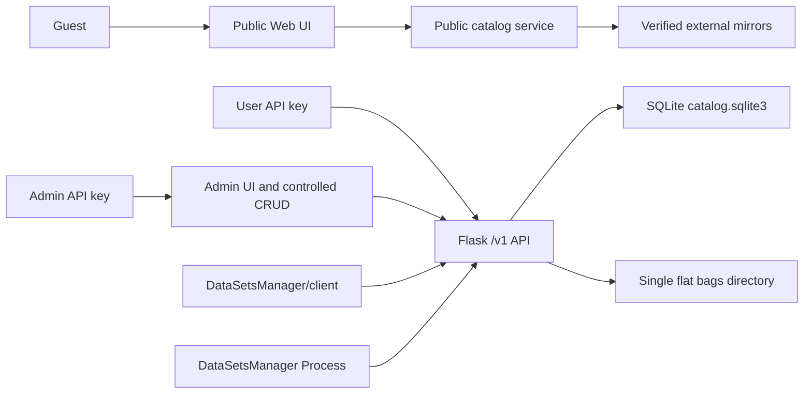

# Server architecture

[Українська версія](architecture.uk.md)

The HTTP application is stateless except for SQLite, staged uploads and the
flat BAG directory in the external runtime root. API-key secrets are generated
server-side, returned once and stored only as SHA-256 digests. The Web UI keeps
entered credentials only in memory.

Backend owns `/v1`, authentication, validation and data migrations. Frontend
owns presentation and never weakens server authorization. Distribution owns
offline Docker and Windows packaging. Process is a pinned external dependency.
