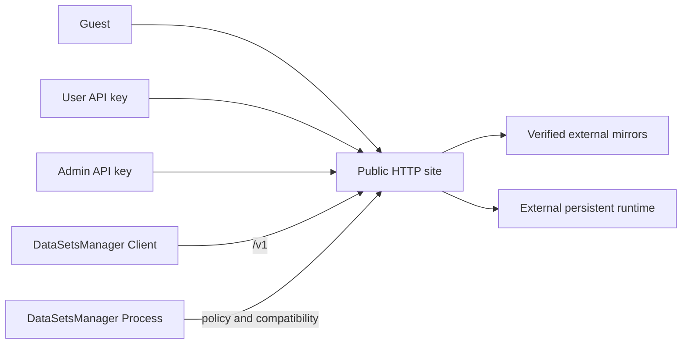
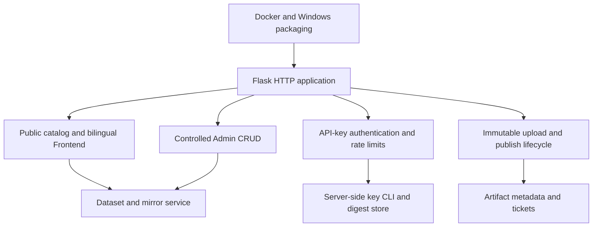
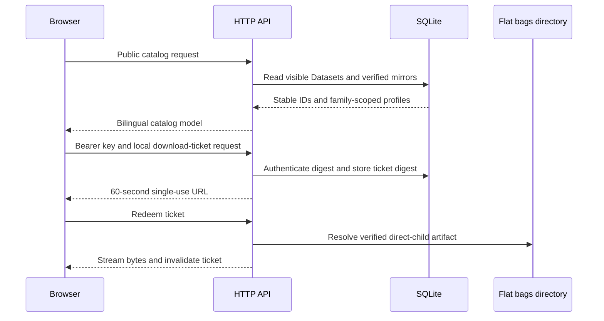
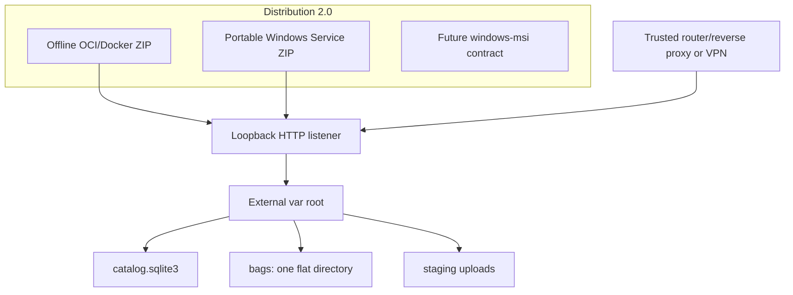
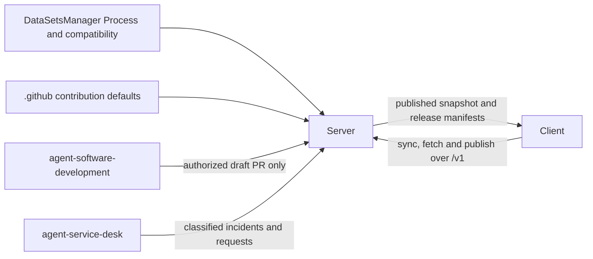

# Server architecture

[Українська версія](architecture.uk.md)

## System context

## Components

## Request and storage data flow

## Deployment view

## Repository interactions

The HTTP application is stateless except for SQLite, staged uploads, and the
flat BAG directory in the external runtime root. API-key secrets are generated
server-side, returned once, and stored only as digests. The Web UI keeps an
entered credential in page memory only.

Backend owns `/v1`, authentication, validation, and data migrations. Frontend
owns presentation and never weakens server authorization. Distribution owns
offline Docker and Windows packaging. Process is a pinned external dependency.
