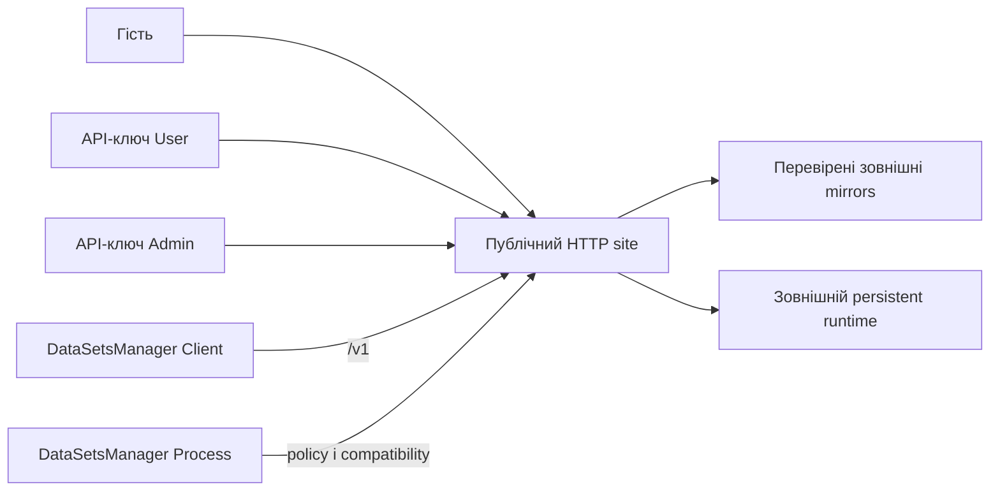
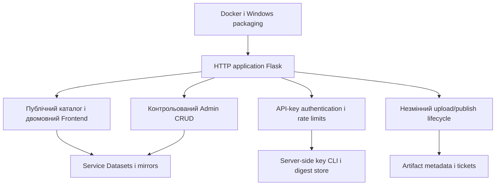
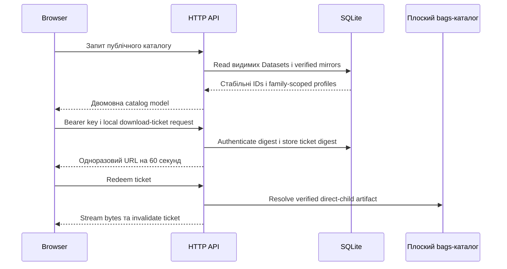
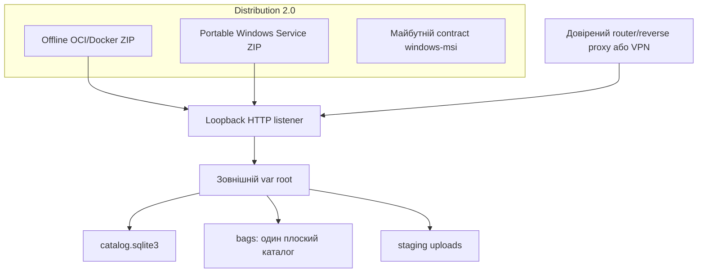
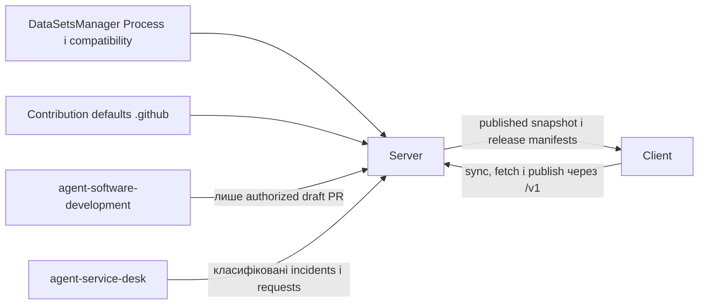

# Архітектура Server

[English version](architecture.md)

## Контекст системи

## Компоненти

## Потік запитів і даних сховища

## Схема розгортання

## Взаємодія репозиторіїв

HTTP application не має стану, крім SQLite, staged uploads і плоского
BAG-каталогу в зовнішньому runtime root. Секрети API-ключів генеруються на
сервері, показуються один раз і зберігаються лише як digests. Web UI тримає
введений credential лише в пам'яті сторінки.

Backend володіє `/v1`, authentication, validation і data migrations. Frontend
володіє presentation і ніколи не послаблює server authorization. Distribution
володіє offline Docker/Windows packaging. Process є pinned external dependency.
