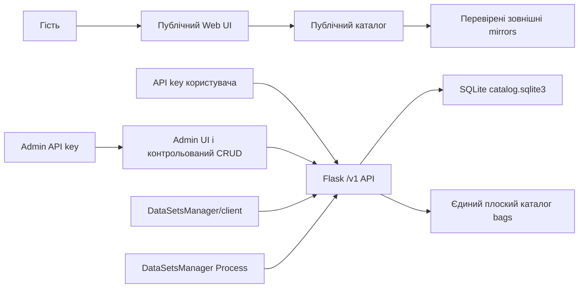

# Архітектура сервера

[English version](architecture.md)

HTTP-застосунок зберігає стан лише у SQLite, staging і плоскому каталозі BAG у
зовнішньому runtime root. Ключі генеруються сервером, показуються один раз і
зберігаються тільки як SHA-256 digest. Web UI тримає введений ключ лише в
пам’яті.

Backend володіє `/v1`, авторизацією, валідацією і міграціями. Frontend відповідає
за представлення та не послаблює серверні права. Distribution пакує автономні
Docker/Windows артефакти. Process є зафіксованою зовнішньою залежністю.
